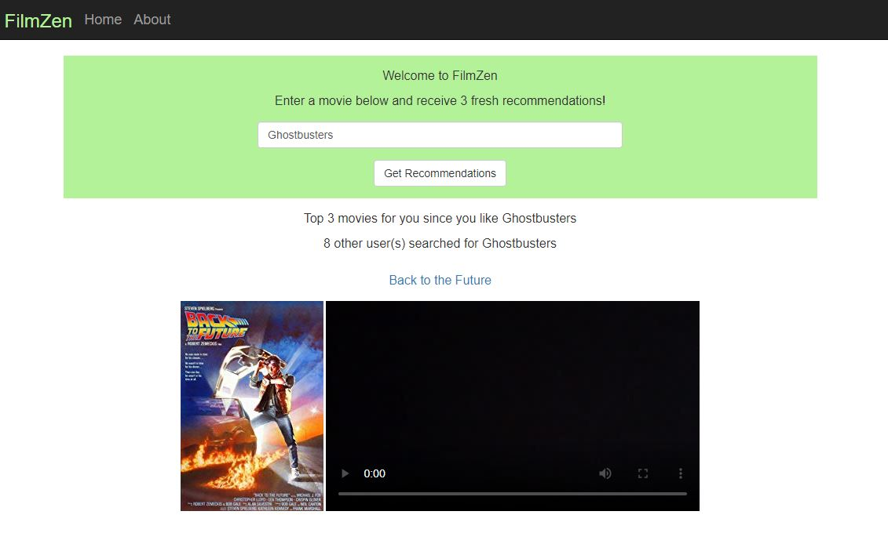
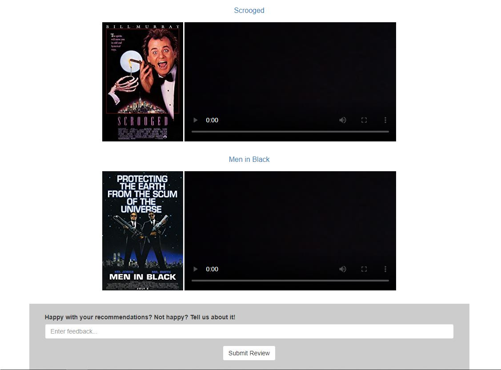

# Filmzen&#46;net (Feb 2018 - Feb 2020)

## Screenshot 

## What is Filmzen&#46;net?

FilmZen keeps you calm in the storm of movie recommendations provided by streaming services.

Watch your next favorite movie with FilmZen. Enter a movie and receive three recommendations based off of that movie. Movies are recommended based on the movie's attributes and the preferences of those who also liked the movie you entered. Only relatively popular movies that came out before March 2015 are in the data set.

The data used to make the recommendations comes from GroupLens.org1. Recommendations are a weighted average of two metrics. The first is the average rating given to movies by those who also liked the entered movie. The second metric is the cosine similarity between the tags given to the movie and tags assigned to all 27,000 movies in the dataset.

As of Febuary 2020, Filmzen&#46;net gave 700+ recommendations to satisfied users

## Website features

- Machine learning algorithm produced cache of movie recommendations 
- Recommendations were cached for speed in a sqlite database
- Movie data and videos came from IMdb
- Feedback form at the bottom of the screen populated feedback portion of the database

## Footnote

Data comes from F. Maxwell Harper and Joseph A. Konstan. 2015. The MovieLens Datasets: History and Context. ACM Transactions on Interactive Intelligent Systems (TiiS) 5, 4, Article 19 (December 2015), 19 pages. DOI=http://dx.doi.org/10.1145/2827872
